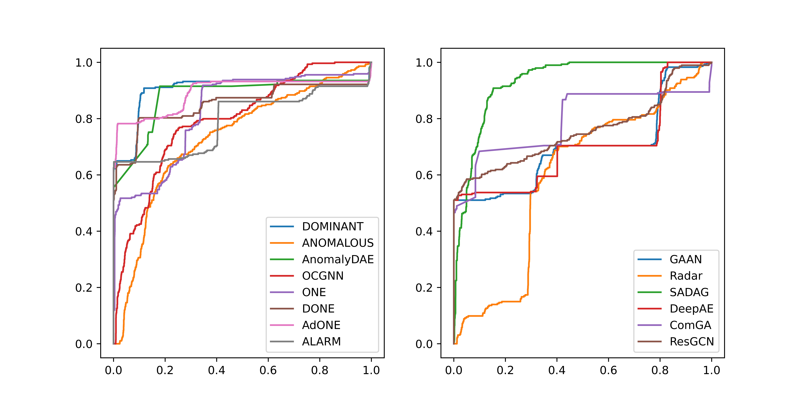

# SAGOD:Static Attributed Graph Outlier Detection

中文README : [cnREADME.md](./cnREADME.md).

SAGOD (**S**tatic **A**ttributed **G**raph **O**utlier **D**etection) is an implementation of anomaly detection models on static attributed graph. Inspierd by [PyOD](https://github.com/yzhao062/pyod) and [PyGOD](https://github.com/pygod-team/pygod), we designed convenient interface to train model and make prediction. SAGOD support the following models:

- [x] [AdONE](paper/done&adone.pdf) : Adversarial Outlier Aware Network Embedding;
- [x] [ALARM](papaer/alarm.pdf) : A deep multi-view framework for anomaly detection;
- [x] [ANOMALOUS](paper/anomalous.pdf) : A Joint Modeling Approach for Anomaly Detection on Attributed Networks;
- [x] [AnomalyDAE](paper/AnomalyDAE.pdf) : Anomaly Detection through a Dual Autoencoder;
- [x] [ComGA](paper/comga.pdf) : Community-Aware Attributed Graph Anomaly Detection;
- [x] [DeepAE](paper/deepae.pdf) : Anomaly Detection with Deep Graph Autoencoders on Attributed Networks.
- [x] [DOMINANT](paper/dominant.pdf) : Deep Anomaly Detection on Attributed Networks;
- [x] [DONE](paper/done&adone.pdf) : Deep Outlier Aware Network Embedding;
- [x] [GAAN](paper/gaan.pdf) : Generative Adversarial Attributed Network;
- [x] [OCGNN](paper/ocgnn.pdf) : One-Class GNN;
- [x] [ONE](paper/one.pdf) : Outlier Aware Network Embedding;
- [x] [Radar](paper/radar.pdf) : Residual Analysis for Anomaly Detection in Attributed Networks.
- [x] [ResGCN](paper/resgcn.pdf) : Residual Graph Convolutional Network.
- [x] [SADAG](paper/sadag.pdf) : Semi-supervised Anomaly Detection on Attributed Graphs.

We are still updating and adding models. It's worth nothing that the original purpose of SAGOD is to implement anomaly detection models on graph, in order to help researchers who are interested in this area (including me).

## Overview

In `test.py`, we generate anomaly data from MUTAG, and use different models to train it. The ROC curve is shown below:

<div align=center></div>

## Install

```bash
pip3 install sagod
```

or

```bash
git clone https://github.com/Kaslanarian/SAGOD
cd SAGOD
python3 setup.py install
```

## Example

Here is an example to use SAGOD:

```python
from sagod.models import DOMINANT
from sagod.utils import struct_ano_injection, attr_ano_injection

data = ... # Graph data, type:torch_geometric.data.Data
data.y = torch.zeros(data.num_nodes)
data = struct_ano_injection(data, 10, 10) # Structrual anomaly injection.
data = attr_ano_injection(data, 100, 50) # Attributed anmaly injection.

model = DOMINANT(verbose=True).fit(data, data.y)
fpr, tpr, _ = roc_curve(data.y.numpy(), model.decision_scores_)[:2]  
plt.plot(fpr, tpr, label='DOMINANT') # plot ROC curve
plt.legend()
plt.show()
```

## Highlight

Though SAGOD is similar to PyGOD, we keep innovating and improving:

- The model "ONE" in PyGOD was implemented based on [authors' responsitory](https://github.com/sambaranban/ONE). We improved it with vectorization, achieving a 100% performance improvement;
- We implemented ALARM, which can detect anomaly in multi-view graph;
- We implemented more models including ComGA, DeepAE, etc, which is not included in PyGOD;
- ...

## Future Plan

- Support batch mechanism and huge graph input;
- Support GPU;
- More models implementation;
- Annotation and manual;
- ...

## Reference

- Bandyopadhyay, Sambaran, Saley Vishal Vivek, and M. N. Murty. ["Outlier resistant unsupervised deep architectures for attributed network embedding."](paper/done&adone.pdf) Proceedings of the 13th international conference on web search and data mining. 2020.
- Bandyopadhyay, Sambaran, N. Lokesh, and M. Narasimha Murty. ["Outlier aware network embedding for attributed networks."](paper/one.pdf) Proceedings of the AAAI conference on artificial intelligence. Vol. 33. No. 01. 2019.
- Fan, Haoyi, Fengbin Zhang, and Zuoyong Li. ["AnomalyDAE: Dual autoencoder for anomaly detection on attributed networks."](paper/AnomalyDAE.pdf) ICASSP 2020-2020 IEEE International Conference on Acoustics, Speech and Signal Processing (ICASSP). IEEE, 2020.
- Chen, Zhenxing, et al. ["Generative adversarial attributed network anomaly detection."](paper/gaan.pdf) Proceedings of the 29th ACM International Conference on Information & Knowledge Management. 2020.
- Ding, Kaize, et al. ["Deep anomaly detection on attributed networks."](paper/dominant.pdf) Proceedings of the 2019 SIAM International Conference on Data Mining. Society for Industrial and Applied Mathematics, 2019.
- Kumagai, Atsutoshi, Tomoharu Iwata, and Yasuhiro Fujiwara. ["Semi-supervised anomaly detection on attributed graphs."](paper/sadag.pdf) 2021 International Joint Conference on Neural Networks (IJCNN). IEEE, 2021.
- Li, Jundong, et al. ["Radar: Residual Analysis for Anomaly Detection in Attributed Networks."](paper/radar.pdf) IJCAI. 2017.
- Luo, Xuexiong, et al. ["ComGA: Community-Aware Attributed Graph Anomaly Detection."](paper/comga.pdf) Proceedings of the Fifteenth ACM International Conference on Web Search and Data Mining. 2022.
- Pei, Yulong, et al. ["ResGCN: attention-based deep residual modeling for anomaly detection on attributed networks."](paper/resgcn.pdf) Machine Learning 111.2 (2022): 519-541.
- Peng, Zhen, et al. ["A deep multi-view framework for anomaly detection on attributed networks."](paper/alarm.pdf) IEEE Transactions on Knowledge and Data Engineering (2020).
- Peng, Zhen, et al. ["ANOMALOUS: A Joint Modeling Approach for Anomaly Detection on Attributed Networks."](paper/anomalous.pdf) IJCAI. 2018.
- Wang, Xuhong, et al. ["One-class graph neural networks for anomaly detection in attributed networks."](paper/ocgnn.pdf) Neural computing and applications 33.18 (2021): 12073-12085.
- Zhu, Dali, Yuchen Ma, and Yinlong Liu. ["Anomaly detection with deep graph autoencoders on attributed networks."](paper/deepae.pdf) 2020 IEEE Symposium on Computers and Communications (ISCC). IEEE, 2020.
