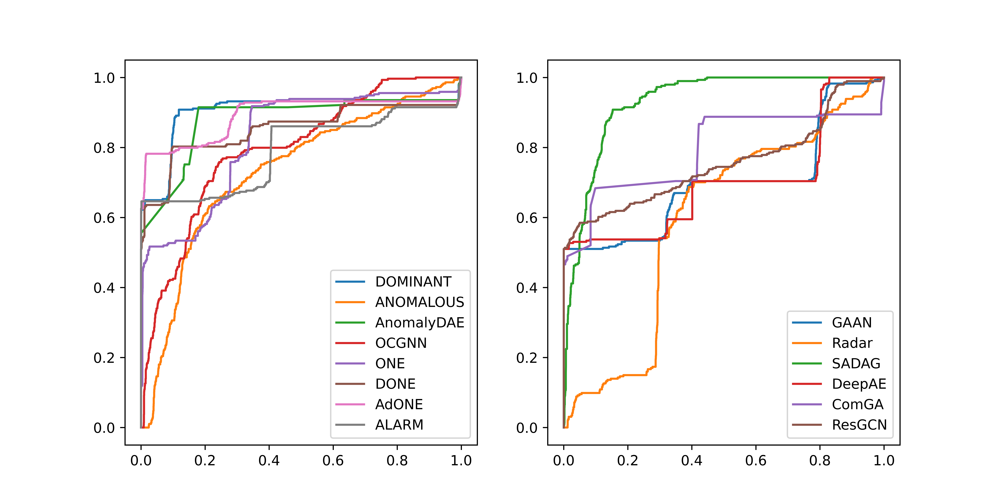

# SAGOD:Static Attributed Graph Outlier Detection

SAGOD (**S**tatic **A**ttributed **G**raph **O**utlier **D**etection) 是基于[PyG](https://www.pyg.org/)对静态属性图异常检测模型的实现。受[PyOD](https://github.com/yzhao062/pyod)和[PyGOD](https://github.com/pygod-team/pygod)的启发，我们设计了易于使用的接口。SAGOD实现了以下模型：

- [x] [AdONE](paper/done&adone.pdf) : Adversarial Outlier Aware Network Embedding;
- [x] [ALARM](papaer/alarm.pdf) : A deep multi-view framework for anomaly detection;
- [x] [ANOMALOUS](paper/anomalous.pdf) : A Joint Modeling Approach for Anomaly Detection on Attributed Networks;
- [x] [AnomalyDAE](paper/AnomalyDAE.pdf) : Anomaly Detection through a Dual Autoencoder;
- [x] [ComGA](paper/comga.pdf) : Community-Aware Attributed Graph Anomaly Detection;
- [x] [DeepAE](paper/deepae.pdf) : Anomaly Detection with Deep Graph Autoencoders on Attributed Networks.
- [x] [DOMINANT](paper/dominant.pdf) : Deep Anomaly Detection on Attributed Networks;
- [x] [DONE](paper/done&adone.pdf) : Deep Outlier Aware Network Embedding;
- [x] [GAAN](paper/gaan.pdf) : Generative Adversarial Attributed Network;
- [x] [OCGNN](paper/ocgnn.pdf) : One-Class GNN;
- [x] [ONE](paper/one.pdf) : Outlier Aware Network Embedding;
- [x] [Radar](paper/radar.pdf) : Residual Analysis for Anomaly Detection in Attributed Networks.
- [x] [ResGCN](paper/resgcn.pdf) : Residual Graph Convolutional Network.
- [x] [SADAG](paper/sadag.pdf) : Semi-supervised Anomaly Detection on Attributed Graphs.

我们正在补充更多的模型实现。**SAGOD的目的是对模型论文的复现，以帮助对该方向感兴趣的研究者，提供便捷的接口只是副产物之一**。

## Overview

`test.py`用各模型训练手动注入异常的MUTAG数据集，生成ROC曲线：

<div align=center></div>

## Example

下面是SAGOD的使用例:

```python
from sagod import DOMINANT
from sagod.utils import struct_ano_injection, attr_ano_injection

data = ... # 获取图数据，即torch_geometric.data.Data类型
data.y = torch.zeros(data.num_nodes) # 定义标签
data = struct_ano_injection(data, 10, 10) # 注入结构异常
data = attr_ano_injection(data, 100, 50) # 注入属性异常

model = DOMINANT(verbose=True).fit(data, data.y) # 输入每轮训练的损失和AUC值
fpr, tpr, _ = roc_curve(data.y.numpy(), model.decision_scores_)[:2]  
plt.plot(fpr, tpr, label='DOMINANT') # 绘制ROC曲线
plt.legend()
plt.show()
```

## Highlight

SAGOD与PyGOD有很大的重合，但我们也进行了创新和改进：

- PyGOD的ONE模型采用了论文作者的实现，我们使用向量化进行改进，实现了100%的性能提升；
- 我们实现了ALARM，能够对多视图进行异常检测；
- 实现了ComGA等模型，这些在PyGOD中并无相应实现；
- ...

## Future Plan

- SAGOD目前只能整图输入，加入batch机制能够大大增加其泛用性;
- 增加对GPU的支持；
- 实现更多的模型，包括非深度模型；
- 注释和手册
- ...

## Reference

- Bandyopadhyay, Sambaran, Saley Vishal Vivek, and M. N. Murty. ["Outlier resistant unsupervised deep architectures for attributed network embedding."](paper/done&adone.pdf) Proceedings of the 13th international conference on web search and data mining. 2020.
- Bandyopadhyay, Sambaran, N. Lokesh, and M. Narasimha Murty. ["Outlier aware network embedding for attributed networks."](paper/one.pdf) Proceedings of the AAAI conference on artificial intelligence. Vol. 33. No. 01. 2019.
- Fan, Haoyi, Fengbin Zhang, and Zuoyong Li. ["AnomalyDAE: Dual autoencoder for anomaly detection on attributed networks."](paper/AnomalyDAE.pdf) ICASSP 2020-2020 IEEE International Conference on Acoustics, Speech and Signal Processing (ICASSP). IEEE, 2020.
- Chen, Zhenxing, et al. ["Generative adversarial attributed network anomaly detection."](paper/gaan.pdf) Proceedings of the 29th ACM International Conference on Information & Knowledge Management. 2020.
- Ding, Kaize, et al. ["Deep anomaly detection on attributed networks."](paper/dominant.pdf) Proceedings of the 2019 SIAM International Conference on Data Mining. Society for Industrial and Applied Mathematics, 2019.
- Kumagai, Atsutoshi, Tomoharu Iwata, and Yasuhiro Fujiwara. ["Semi-supervised anomaly detection on attributed graphs."](paper/sadag.pdf) 2021 International Joint Conference on Neural Networks (IJCNN). IEEE, 2021.
- Li, Jundong, et al. ["Radar: Residual Analysis for Anomaly Detection in Attributed Networks."](paper/radar.pdf) IJCAI. 2017.
- Luo, Xuexiong, et al. ["ComGA: Community-Aware Attributed Graph Anomaly Detection."](paper/comga.pdf) Proceedings of the Fifteenth ACM International Conference on Web Search and Data Mining. 2022.
- Pei, Yulong, et al. ["ResGCN: attention-based deep residual modeling for anomaly detection on attributed networks."](paper/resgcn.pdf) Machine Learning 111.2 (2022): 519-541.
- Peng, Zhen, et al. ["A deep multi-view framework for anomaly detection on attributed networks."](paper/alarm.pdf) IEEE Transactions on Knowledge and Data Engineering (2020).
- Peng, Zhen, et al. ["ANOMALOUS: A Joint Modeling Approach for Anomaly Detection on Attributed Networks."](paper/anomalous.pdf) IJCAI. 2018.
- Wang, Xuhong, et al. ["One-class graph neural networks for anomaly detection in attributed networks."](paper/ocgnn.pdf) Neural computing and applications 33.18 (2021): 12073-12085.
- Zhu, Dali, Yuchen Ma, and Yinlong Liu. ["Anomaly detection with deep graph autoencoders on attributed networks."](paper/deepae.pdf) 2020 IEEE Symposium on Computers and Communications (ISCC). IEEE, 2020.
